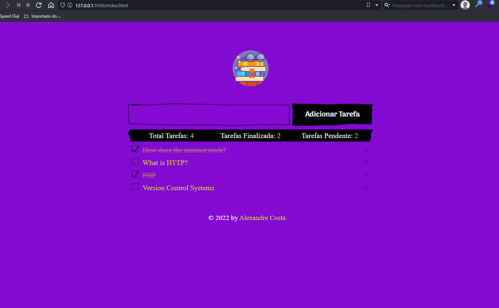
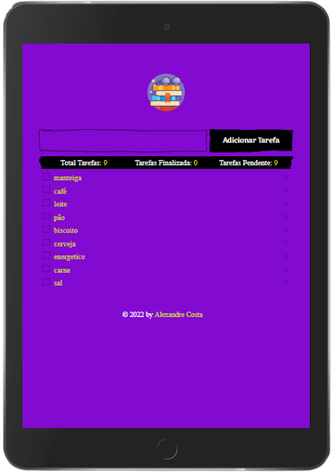
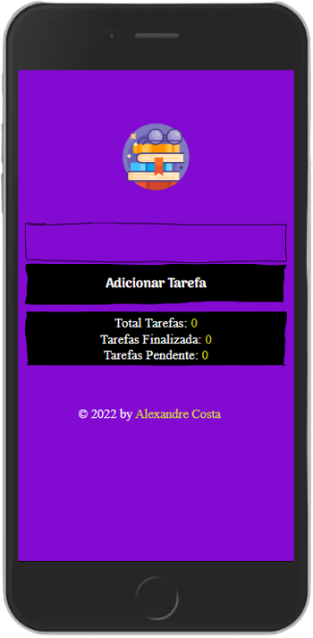

<h2 align="center">
  Gerenciador de Tarefas - Todolist
</h2>

### v1.0 - [https://github.com/MrMadaraUchiha/Task-Manager/](https://github.com/MrMadaraUchiha/Task-Manager/)

 

 

<!--<-->
<!--<-->

</img>

 

</img>

---

## Tecnologias e ferramentas
Para o desenvolvimento deste projeto utilizei:
- JavaScript
- HTML5
- CSS3
- Visual studio Code v1.67.1
